# 🔐 Sistema 2FA (Two-Factor Authentication)

Documentazione completa del sistema di autenticazione a due fattori per Finch-AI Area Clienti.

## 📋 Indice

1. [Panoramica](#panoramica)
2. [Installazione](#installazione)
3. [Architettura](#architettura)
4. [Funzionalità](#funzionalità)
5. [Flusso Utente](#flusso-utente)
6. [API Reference](#api-reference)
7. [Sicurezza](#sicurezza)
8. [Troubleshooting](#troubleshooting)

---

## 📖 Panoramica

Il sistema 2FA implementa l'autenticazione a due fattori basata su **TOTP (Time-based One-Time Password)** secondo lo standard **RFC 6238**, compatibile con:

- ✅ Google Authenticator
- ✅ Microsoft Authenticator
- ✅ Authy
- ✅ Qualsiasi app TOTP-compliant

### Caratteristiche Principali

- 🔒 **TOTP Algorithm**: SHA-1, 6 digit, 30 secondi
- 🔑 **Backup Codes**: 10 codici usa-e-getta
- 📱 **Dispositivi Fidati**: "Ricorda questo dispositivo per 30 giorni"
- 📊 **Audit Trail**: Log completo di tutti i tentativi
- 🚫 **Rate Limiting**: Blocco dopo 5 tentativi falliti
- ⏰ **Window Tolerance**: ±1 periodo (90 secondi totali)

---

## 🛠 Installazione

### 1. Database Schema

Esegui lo script SQL:

```bash
mysql -u root -p finch_ai < database/add_2fa_system.sql
```

Questo crea:

**Tabelle:**
- `auth_2fa_log` - Log tentativi 2FA
- `auth_trusted_devices` - Dispositivi fidati
- Modifica `utenti` aggiungendo colonne 2FA

**Viste:**
- `v_2fa_status` - Statistiche 2FA per admin

**Eventi:**
- `cleanup_2fa_logs` - Pulizia log ogni giorno
- `cleanup_trusted_devices` - Pulizia dispositivi scaduti ogni ora

**Trigger:**
- `audit_2fa_enabled` - Log quando 2FA viene abilitato
- `audit_2fa_disabled` - Log quando 2FA viene disabilitato

### 2. File Creati

```
area-clienti/
├── includes/
│   └── totp.php                    # Libreria TOTP (già esistente)
├── admin/
│   └── security-2fa.php            # Interfaccia gestione 2FA
├── api/
│   └── 2fa.php                     # API 2FA
└── verify-2fa.php                  # Pagina verifica al login

database/
└── add_2fa_system.sql              # Schema database
```

### 3. Verifica Installazione

```sql
-- Verifica tabelle create
SHOW TABLES LIKE '%2fa%';

-- Verifica colonne utenti
DESCRIBE utenti;

-- Test vista
SELECT * FROM v_2fa_status;
```

---

## 🏗 Architettura

### Database Schema

#### Colonne Utenti (`utenti`)

```sql
auth_2fa_enabled BOOLEAN NOT NULL DEFAULT FALSE
auth_2fa_secret VARCHAR(255) NULL              -- Secret TOTP (base32)
auth_2fa_backup_codes JSON NULL                -- Array di hash bcrypt
auth_2fa_enabled_at TIMESTAMP NULL
```

#### Tabella Log (`auth_2fa_log`)

```sql
CREATE TABLE auth_2fa_log (
    id BIGINT AUTO_INCREMENT PRIMARY KEY,
    user_id INT NOT NULL,
    user_email VARCHAR(255) NOT NULL,
    ip_address VARCHAR(45) NOT NULL,
    user_agent TEXT NULL,

    verification_type ENUM('totp', 'backup_code') NOT NULL,

    success BOOLEAN NOT NULL,
    failure_reason VARCHAR(255) NULL,

    created_at TIMESTAMP NOT NULL DEFAULT CURRENT_TIMESTAMP
);
```

#### Tabella Dispositivi Fidati (`auth_trusted_devices`)

```sql
CREATE TABLE auth_trusted_devices (
    id BIGINT AUTO_INCREMENT PRIMARY KEY,
    user_id INT NOT NULL,

    device_token VARCHAR(255) NOT NULL UNIQUE,
    device_name VARCHAR(255) NULL,
    device_fingerprint VARCHAR(255) NULL,

    ip_address VARCHAR(45) NOT NULL,
    user_agent TEXT NULL,

    trusted_at TIMESTAMP NOT NULL DEFAULT CURRENT_TIMESTAMP,
    last_used_at TIMESTAMP NOT NULL DEFAULT CURRENT_TIMESTAMP,
    expires_at TIMESTAMP NOT NULL,              -- +30 giorni
    is_active BOOLEAN NOT NULL DEFAULT TRUE
);
```

### Libreria TOTP

La classe `TOTP` in `includes/totp.php` fornisce:

```php
class TOTP {
    public static function generateSecret($length = 16): string
    public static function generateCode($secret, $timestamp = null, $digits = 6, $period = 30): string
    public static function verifyCode($secret, $code, $discrepancy = 1, $timestamp = null): bool
    public static function getQRCodeURL($secret, $email, $issuer = 'Finch-AI'): string
    public static function getProvisioningURI($secret, $email, $issuer = 'Finch-AI'): string
}
```

**Algoritmo TOTP:**

1. Converte `timestamp / 30` in counter
2. Applica HMAC-SHA1 tra counter e secret
3. Dynamic truncation per ottenere 6 cifre
4. Verifica con window ±1 (90 secondi totali)

---

## 🎯 Funzionalità

### 1. Abilitazione 2FA

**URL:** `area-clienti/admin/security-2fa.php`

**Processo:**

1. Admin clicca "Abilita 2FA"
2. Sistema genera secret casuale (16 char base32)
3. Mostra QR code per scansione
4. Mostra secret manuale come fallback
5. Admin inserisce codice dall'app
6. Sistema verifica codice
7. Se valido:
   - Salva secret (plaintext)
   - Genera 10 backup codes
   - Hash backup codes con bcrypt
   - Mostra backup codes all'admin
   - Abilita 2FA nel database

**Screenshot Flow:**

```
┌─────────────────────────────────┐
│  Stato 2FA: Disabilitato        │
│  [ Abilita 2FA ]                │
└─────────────────────────────────┘
           ↓
┌─────────────────────────────────┐
│  1. Scarica app Authenticator   │
│  2. Scansiona QR Code           │
│     ┌─────────┐                 │
│     │  █▀▀█   │                 │
│     │  ▀▀█▀   │  QR Code        │
│     │  █▄▄█   │                 │
│     └─────────┘                 │
│     Secret: JBSWY3DPEHPK3PXP    │
│  3. Inserisci codice            │
│     [______]                    │
│     [ Verifica ]                │
└─────────────────────────────────┘
           ↓
┌─────────────────────────────────┐
│  ✅ 2FA Abilitato!              │
│                                 │
│  🔑 Backup Codes (salvali!)     │
│  ┌────────┬────────┐            │
│  │ 1234-5678 │ 9012-3456 │      │
│  │ 4567-8901 │ 2345-6789 │      │
│  └────────┴────────┘            │
│  [ Download ] [ Stampa ]        │
└─────────────────────────────────┘
```

### 2. Login con 2FA

**Flusso:**

```
1. Utente: email + password ───→ login.php
                                    │
                                    ↓
2. Verifica credenziali ────────→ ✅ Valide
                                    │
                                    ↓
3. Controlla auth_2fa_enabled ──→ TRUE
                                    │
                                    ↓
4. Verifica dispositivo fidato ──→ Cookie '2fa_device'
                                    │
                                    ├─→ Trovato & Valido → Dashboard
                                    │
                                    └─→ Non trovato ─→ verify-2fa.php
                                                          │
                                                          ↓
5. Mostra form 6 digit ──────────→ [ ][ ][ ][ ][ ][ ]
                                    │
                                    ↓
6. Verifica codice TOTP ─────────→ api/2fa.php?action=verify
                                    │
                                    ├─→ Valido → Dashboard
                                    │
                                    └─→ Non valido → Errore (5 tentativi max)
```

### 3. Backup Codes

**Generazione:**
- 10 codici da 8 cifre
- Formato: `XXXX-XXXX`
- Hash con bcrypt prima del salvataggio
- Uso singolo (vengono rimossi dopo l'uso)

**Esempio:**
```
2468-1357
9753-8642
1122-3344
4455-6677
7788-9900
0011-2233
3344-5566
6677-8899
8899-0011
1100-2211
```

**Uso:**
1. Admin perde dispositivo
2. Click "Usa un backup code"
3. Inserisce codice (es: `2468-1357`)
4. Sistema verifica hash
5. Se valido, rimuove codice usato
6. Accesso consentito

**Rigenerazione:**
1. Vai su `security-2fa.php`
2. Click "Rigenera Backup Codes"
3. Vecchi codici invalidati
4. Nuovi 10 codici generati

### 4. Dispositivi Fidati

Checkbox "Ricorda questo dispositivo per 30 giorni"

**Meccanismo:**

1. Al login con 2FA, checkbox selezionato
2. Sistema genera token casuale (64 hex chars)
3. Salva in `auth_trusted_devices`:
   - `device_token`: token univoco
   - `device_fingerprint`: MD5(user-agent)
   - `expires_at`: NOW + 30 giorni
4. Invia cookie `2fa_device` con token
5. Ai login successivi:
   - Legge cookie
   - Verifica token in DB
   - Se valido e non scaduto → skip 2FA

**Revoca:**

```php
// Rimuovi singolo dispositivo
UPDATE auth_trusted_devices
SET is_active = FALSE
WHERE id = :device_id AND user_id = :user_id

// Rimuovi tutti i dispositivi
UPDATE auth_trusted_devices
SET is_active = FALSE
WHERE user_id = :user_id
```

### 5. Rate Limiting

**Protezione contro brute force:**

```php
// Conta tentativi falliti ultimi 15 minuti
SELECT COUNT(*) FROM auth_2fa_log
WHERE user_id = :user_id
AND success = FALSE
AND created_at >= DATE_SUB(NOW(), INTERVAL 15 MINUTE)

// Se >= 5 → Blocco temporaneo
if ($attempts >= 5) {
    // Mostra errore "Account bloccato per 15 minuti"
    // Disabilita form
}
```

**Reset automatico:**
- Dopo 15 minuti i tentativi non contano più
- Oppure dopo 1 successo

---

## 🔄 Flusso Utente

### Setup Iniziale

```mermaid
graph TD
    A[Admin Dashboard] --> B[Sicurezza 2FA]
    B --> C[Click 'Abilita 2FA']
    C --> D[Scarica App Authenticator]
    D --> E[Scansiona QR / Inserisci Secret]
    E --> F[Inserisci codice 6 cifre]
    F --> G{Codice valido?}
    G -->|Sì| H[2FA Abilitato]
    G -->|No| F
    H --> I[Mostra Backup Codes]
    I --> J[Scarica/Stampa Codes]
    J --> K[Completo!]
```



### Login Quotidiano


---

## 📡 API Reference

### Endpoint: `/api/2fa.php`

Tutti gli endpoint richiedono autenticazione (sessione attiva).

---

#### `GET ?action=setup`

Genera secret e QR code per setup iniziale.

**Response:**
```json
{
  "success": true,
  "secret": "JBSWY3DPEHPK3PXP",
  "qr_code_url": "https://chart.googleapis.com/chart?chs=200x200&cht=qr&chl=...",
  "provisioning_uri": "otpauth://totp/Finch-AI:admin@finch-ai.it?secret=..."
}
```

---

#### `POST action=enable`

Abilita 2FA dopo verifica codice.

**Body:**
```json
{
  "action": "enable",
  "secret": "JBSWY3DPEHPK3PXP",
  "code": "123456"
}
```

**Response:**
```json
{
  "success": true,
  "backup_codes": [
    "2468-1357",
    "9753-8642",
    ...
  ],
  "message": "2FA abilitato con successo"
}
```

**Errors:**
- `400`: Codice non valido
- `400`: Secret mancante

---

#### `POST action=disable`

Disabilita 2FA (richiede verifica codice).

**Body:**
```json
{
  "action": "disable",
  "code": "123456"  // TOTP o backup code
}
```

**Response:**
```json
{
  "success": true,
  "message": "2FA disabilitato"
}
```

**Errors:**
- `400`: Codice non valido
- `400`: 2FA non abilitato

---

#### `POST action=regenerate_backup_codes`

Rigenera 10 nuovi backup codes.

**Body:**
```json
{
  "action": "regenerate_backup_codes"
}
```

**Response:**
```json
{
  "success": true,
  "backup_codes": [
    "1100-2211",
    "3322-4433",
    ...
  ],
  "message": "Backup codes rigenerati"
}
```

---

#### `POST action=verify`

Verifica codice 2FA al login.

**Body:**
```json
{
  "action": "verify",
  "code": "123456",
  "trust_device": true  // opzionale
}
```

**Response:**
```json
{
  "success": true,
  "verified_via": "totp",  // o "backup_code"
  "message": "Codice verificato"
}
```

**Side effects:**
- Imposta `$_SESSION['2fa_verified'] = true`
- Se `trust_device=true`, crea cookie e record in DB

**Errors:**
- `400`: Codice non valido
- `400`: Account bloccato (troppi tentativi)

---

#### `POST action=remove_device`

Rimuove dispositivo fidato.

**Body:**
```json
{
  "action": "remove_device",
  "device_id": 123
}
```

**Response:**
```json
{
  "success": true,
  "message": "Dispositivo rimosso"
}
```

---

#### `GET ?action=check_trusted_device`

Verifica se dispositivo corrente è fidato.

**Response:**
```json
{
  "success": true,
  "is_trusted": true
}
```

---

## 🔒 Sicurezza

### Best Practices Implementate

1. **Secret Storage**
   - ✅ Secret salvati in plaintext (necessario per TOTP)
   - ⚠️ IMPORTANTE: Database deve essere sicuro
   - ✅ Backup codes hashati con bcrypt

2. **Rate Limiting**
   - ✅ Massimo 5 tentativi in 15 minuti
   - ✅ Blocco temporaneo dopo 5 fallimenti
   - ✅ Reset automatico dopo 15 minuti

3. **Window Tolerance**
   - ✅ Accetta codici ±1 periodo (90 secondi totali)
   - ✅ Previene problemi di clock skew
   - ✅ Bilanciamento sicurezza/UX

4. **Backup Codes**
   - ✅ 10 codici usa-e-getta
   - ✅ Hash bcrypt (cost 10)
   - ✅ Rimossi dopo l'uso
   - ✅ Rigenerabili

5. **Dispositivi Fidati**
   - ✅ Token random 256-bit
   - ✅ Scadenza 30 giorni
   - ✅ Cookie HTTP-only + Secure
   - ✅ Revocabili manualmente

6. **Audit Trail**
   - ✅ Log ogni tentativo (successo/fallimento)
   - ✅ IP + User-Agent tracking
   - ✅ Retention 90 giorni
   - ✅ Trigger automatici

7. **Timing Attack Protection**
   - ✅ `hash_equals()` per confronto codici
   - ✅ Nessuna informazione su successo parziale

### Raccomandazioni Deployment

```php
// config.php
define('MFA_DIGITS', 6);              // 6 cifre (standard)
define('MFA_PERIOD', 30);             // 30 secondi (standard)
define('MFA_ISSUER', 'Finch-AI');     // Nome servizio
define('MFA_WINDOW', 1);              // ±1 periodo tolleranza

// Cookie settings
$cookieOptions = [
    'lifetime' => 30 * 24 * 60 * 60,  // 30 giorni
    'path' => '/area-clienti',
    'domain' => 'finch-ai.it',
    'secure' => true,                  // HTTPS only
    'httponly' => true,                // No JavaScript
    'samesite' => 'Lax'
];
```

### Checklist Sicurezza

- [ ] Database su server sicuro
- [ ] HTTPS obbligatorio (certificato SSL valido)
- [ ] Cookie con flag Secure + HttpOnly
- [ ] Backup database regolari (secret salvati in plaintext)
- [ ] Monitoring log 2FA per attività sospette
- [ ] Policy: 2FA obbligatorio per super admin
- [ ] Recovery process documentato
- [ ] Test penetration test

---

## 🐛 Troubleshooting

### Problema: "Codice non valido" ma il codice è corretto

**Causa:** Clock skew tra server e dispositivo

**Soluzione:**
```bash
# Verifica orario server
date

# Sincronizza con NTP
sudo ntpdate pool.ntp.org

# O installa NTP daemon
sudo apt-get install ntp
sudo systemctl start ntp
```

**Alternativa:**
Aumenta window tolerance (NON raccomandato per prod):
```php
// In TOTP::verifyCode()
$discrepancy = 2;  // ±2 periodi = 150 secondi
```

---

### Problema: Backup codes non funzionano

**Debug:**
```php
// Verifica formato
var_dump($user['auth_2fa_backup_codes']);

// Deve essere JSON array di hash bcrypt:
// ["$2y$10$abc...", "$2y$10$def...", ...]

// Test manuale
$code = '2468-1357';
$codeNoSpaces = str_replace('-', '', $code);  // "24681357"

$backupCodes = json_decode($user['auth_2fa_backup_codes'], true);
foreach ($backupCodes as $hash) {
    if (password_verify($codeNoSpaces, $hash)) {
        echo "MATCH!";
    }
}
```

---

### Problema: Troppi tentativi falliti

**Reset manuale:**
```sql
-- Rimuovi blocco temporaneo
DELETE FROM auth_2fa_log
WHERE user_id = 123
AND success = FALSE
AND created_at >= DATE_SUB(NOW(), INTERVAL 15 MINUTE);
```

**Prevenzione:**
```sql
-- Aumenta finestra reset (da 15 a 30 min)
-- Modifica in verify-2fa.php e api/2fa.php
```

---

### Problema: Dispositivo fidato non funziona

**Debug cookie:**
```javascript
// Browser console
document.cookie
// Cerca: 2fa_device=...

// Se mancante, controlla:
// 1. Cookie flags (Secure su HTTPS)
// 2. SameSite policy
// 3. Domain/Path corretti
```

**Verifica database:**
```sql
SELECT * FROM auth_trusted_devices
WHERE device_token = 'xxx'
AND is_active = TRUE
AND expires_at > NOW();
```

---

### Problema: QR Code non si carica

**Causa:** Google Charts API bloccato/lento

**Soluzione 1:** Usa API alternativa
```php
// In TOTP::getQRCodeURL()
return 'https://api.qrserver.com/v1/create-qr-code/?size=200x200&data='
    . urlencode($otpauthURL);
```

**Soluzione 2:** Genera QR lato server
```bash
composer require endroid/qr-code
```

```php
use Endroid\QrCode\QrCode;

$qrCode = QrCode::create($otpauthURL)
    ->setSize(200)
    ->setMargin(10);

$writer = new PngWriter();
$result = $writer->write($qrCode);

// Output inline
echo 'getDataUri() . '">';
```

---

### Problema: Admin bloccato fuori (perde dispositivo + backup codes)

**Recovery manuale (DBA):**

```sql
-- OPZIONE 1: Disabilita 2FA
UPDATE utenti
SET
    auth_2fa_enabled = FALSE,
    auth_2fa_secret = NULL,
    auth_2fa_backup_codes = NULL
WHERE id = 123;

-- OPZIONE 2: Genera nuovi backup codes manualmente
-- Genera codice e hash
-- In PHP:
$code = '1234-5678';
$hash = password_hash(str_replace('-', '', $code), PASSWORD_DEFAULT);

-- Inserisci hash in DB
UPDATE utenti
SET auth_2fa_backup_codes = '["$2y$10$..."]'
WHERE id = 123;

-- Comunica codice all'admin via canale sicuro
```

**Processo consigliato:**
1. Verifica identità admin (telefono, documento)
2. Genera 1 backup code temporaneo
3. Admin fa login con backup code
4. Admin rigenera backup codes normalmente
5. Log audit trail per compliance

---

## 📊 Monitoring & Analytics

### Query Utili

**Statistiche 2FA generale:**
```sql
SELECT
    COUNT(DISTINCT user_id) as total_users_with_2fa,
    SUM(CASE WHEN success = TRUE THEN 1 ELSE 0 END) as successful_logins,
    SUM(CASE WHEN success = FALSE THEN 1 ELSE 0 END) as failed_attempts,
    SUM(CASE WHEN verification_type = 'totp' THEN 1 ELSE 0 END) as totp_usage,
    SUM(CASE WHEN verification_type = 'backup_code' THEN 1 ELSE 0 END) as backup_code_usage
FROM auth_2fa_log
WHERE created_at >= DATE_SUB(NOW(), INTERVAL 30 DAY);
```

**Admin con 2FA:**
```sql
SELECT * FROM v_2fa_status
ORDER BY auth_2fa_enabled DESC, failed_logins_30d DESC;
```

**Tentativi sospetti:**
```sql
-- IP con molti fallimenti
SELECT
    ip_address,
    COUNT(*) as attempts,
    COUNT(DISTINCT user_id) as different_users
FROM auth_2fa_log
WHERE success = FALSE
AND created_at >= DATE_SUB(NOW(), INTERVAL 24 HOUR)
GROUP BY ip_address
HAVING attempts >= 10
ORDER BY attempts DESC;
```

**Dispositivi fidati scaduti:**
```sql
SELECT
    u.email,
    td.device_name,
    td.expires_at,
    DATEDIFF(NOW(), td.expires_at) as days_expired
FROM auth_trusted_devices td
JOIN utenti u ON td.user_id = u.id
WHERE td.is_active = TRUE
AND td.expires_at < NOW();
```

---

## ✅ Checklist Go-Live

### Pre-Produzione

- [ ] Database backup completo
- [ ] Test setup 2FA con Google Authenticator
- [ ] Test setup 2FA con Microsoft Authenticator
- [ ] Test login con TOTP
- [ ] Test login con backup code
- [ ] Test dispositivo fidato (cookie)
- [ ] Test rate limiting (5 tentativi)
- [ ] Test rigenerazione backup codes
- [ ] Test disabilitazione 2FA
- [ ] Verifica trigger audit log
- [ ] Verifica eventi MySQL (cleanup)
- [ ] Test recovery manuale admin bloccato

### Configurazione Server

- [ ] NTP sincronizzazione attiva
- [ ] HTTPS con certificato valido
- [ ] Cookie Secure flag funzionante
- [ ] Session timeout configurato
- [ ] Log rotation configurato
- [ ] Backup database automatico

### Documentazione

- [ ] Guida utente per setup 2FA
- [ ] Procedura recovery admin bloccato
- [ ] Runbook incident response
- [ ] Policy 2FA aziendale

### Security Review

- [ ] Penetration test 2FA bypass
- [ ] Code review libreria TOTP
- [ ] Verifica secret storage (encryption?)
- [ ] Test timing attacks
- [ ] Audit log review

---

## 📞 Supporto

Per problemi o domande:

- 📧 Email: dev@finch-ai.it
- 📚 Docs: `/SISTEMA_2FA.md`
- 🔍 Audit Log: `area-clienti/admin/audit-log.php`
- 🛠 Recovery: Contattare DBA

---

## 📝 Changelog

### v1.0.0 (2024-12-20)
- ✅ Implementazione iniziale TOTP
- ✅ Backup codes (10 usa-e-getta)
- ✅ Dispositivi fidati (30 giorni)
- ✅ Rate limiting (5 tentativi / 15 min)
- ✅ Audit trail completo
- ✅ UI setup con QR code
- ✅ UI verifica al login
- ✅ Integrazione login.php

---

**Fine Documentazione Sistema 2FA** 🔐
